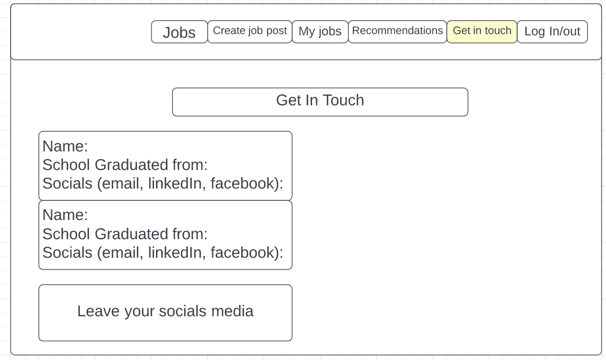

# Tech Job Seekers

Access: https://tech-job-seekers.herokuapp.com/

## Technologies used:
- JavaScript
- HTML
- CSS
- MongoDB
- Express
- React
- Node

## User Stories:
- As a user, I want to log in and log out
- As a user, I want to be able to add job postings they have seen to share with others (link, job title, company, location, description, if still hiring)
- As a user, I want to see all posts that other users have added.
- As a user, I want to be able to delete and edit their own postings and comments
- As a user, I want to click the job post and see the details of the job

# Wireframe:

## Icebox: 
- I want a get in touch page that has the school user has attended or if they are self-taught and their social media
- I want a resource page for users to share links or names of other resources for people to prepare better
- I want to create a page for recommendations (interview recommendations, application recommendations and things they have done wrong)
